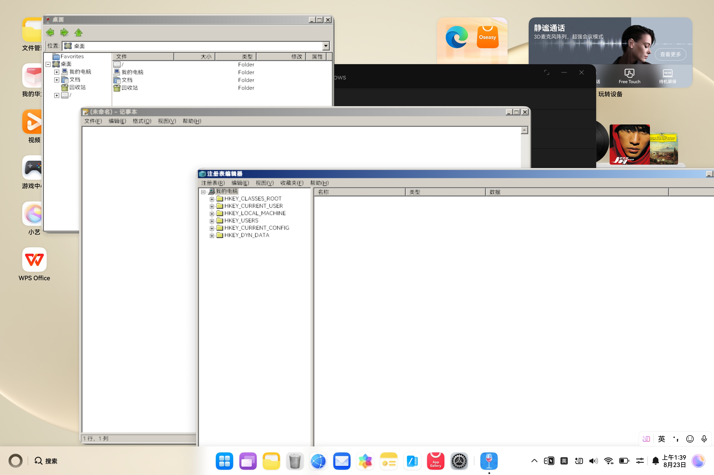

# VintagePomelo — Wine on HarmonyOS

在 HarmonyOS (OpenHarmony) 设备上运行 Windows x86_64 程序，通过 Box64 指令翻译，嵌入 Wayland compositor 渲染窗口。



## 架构

```
Windows PE (x86_64)
    ↓ Box64 (x86_64 → ARM64 指令翻译)
Wine (x86_64, musl libc)
    ↓ winewayland.drv
嵌入式 Wayland compositor (ARM64 原生, HAP 进程内)
    ├── WaylandServer (wl_compositor, xdg_shell, wl_seat)
    ├── InputManager  (鼠标/键盘事件注入)
    ├── EglRenderer   (EGL/GLES → XComponent 上屏, Native VSync)
    ├── GraphicsBroker (VirGL host 管理)
    └── AudioBroker    (Host-broker 音频引擎)
```

arm64 下 Box64 编译为 **共享库 (box64.so)**，由 NCP 子进程 dlopen 加载，通过 `box64_hmos_main()` 在同一进程内模拟执行 x86_64 Wine ELF。
x86_64 下 Wine 原生 .so 由系统 linker 直接加载。

## 当前状态

| 功能 | 状态 |
|------|------|
| ARM64 Box64 .so 方案 | ✅ |
| x86_64 Wine .so 方案 | ✅ |
| Explorer 桌面 | ✅ |
| 多窗口 | ✅ |
| 鼠标 / 键盘输入 | ✅ |
| 音频 (WASAPI / DSound / waveOut / MCI / MIDI) | ✅ |
| VirGL / OpenGL (guest Mesa virpipe) | ✅ |
| NAPI 沙箱运行 | ✅ |

## 构建

```bash
# 完整构建
make NATIVE_ARCH=arm64-v8a

# 仅 HAP (只改 ArkTS / C++)
make NATIVE_ARCH=arm64-v8a hap

# 详细文档: docs/BUILD_GUIDE.md
```

## 目录结构

```
WineHua/
├── entry/src/main/
│   ├── cpp/                   # Native C++: Wayland compositor, EGL, Input, Audio
│   │   ├── napi_init.cpp      # NAPI 桥接 + wine/wineserver/broker 进程管理
│   │   ├── wine_child.cpp     # NCP 子进程入口 (Main/WineserverMain/MmapTestMain)
│   │   ├── virgl_child.cpp    # VirGL NCP 子进程入口
│   │   ├── wayland_server.cpp # 嵌入式 Wayland compositor
│   │   ├── egl_renderer.cpp   # EGL/GLES 渲染器 (Native VSync)
│   │   ├── input_manager.cpp  # 鼠标/键盘事件注入
│   │   ├── broker.cpp         # Broker 中继 (CreateProcess → NCP)
│   │   ├── graphics_broker.cpp # VirGL 后端管理
│   │   ├── audio_broker.cpp   # Host-broker 音频引擎
│   │   ├── wine_env.cpp       # 环境变量构建
│   │   ├── wine_launch.cpp    # 启动流程 (wineserver → wineboot → explorer)
│   │   └── xdg_shell.cpp      # xdg-shell 协议实现
│   ├── ets/pages/
│   │   ├── Index.ets          # 主界面 (侧边栏 + 桌面)
│   │   ├── WineWindow.ets     # Wine 子窗口
│   │   └── DesktopWindow.ets  # 桌面窗口
│   └── ets/model/
│       └── WineWindowManager.ets  # 窗口生命周期管理
├── scripts/
│   ├── env.sh                 # 环境变量 (NATIVE_ARCH, 工具链)
│   ├── build_wine.sh          # Wine 构建
│   ├── build_box64.sh         # Box64 构建 (box64.so)
│   ├── build_guest_gfx.sh     # Guest Mesa (VirGL) 构建
│   ├── assemble.sh            # rawfile zip + libs/ 布局
│   └── check-submodules.sh    # Submodule 状态检查
├── docs/                      # 详细文档
│   ├── CURRENT_STATUS.md      # 当前状态 & 修复清单
│   ├── ARCHITECTURE.md        # 架构详解
│   ├── BUILD_GUIDE.md         # 构建指南
│   └── README.md              # 文档索引
├── .claude/rules/
│   ├── build-and-log.md       # 构建命令与日志速查
│   └── submodule-workflow.md  # Submodule 管理方案
└── thirdparty/                # git submodule
    ├── wine/                  # winehua/wine
    ├── box64/                 # winehua/box64
    ├── mesa/                  # winehua/mesa-ohos
    ├── virglrenderer/         # winehua/virglrenderer
    ├── libepoxy/              # winehua/libepoxy
    ├── freetype/
    ├── wayland/
    └── xkeyboard-config/
```

## 关键适配

- **Box64**: x86_64 → ARM64 指令翻译 (Dynarec)，编译为 box64.so 由 NCP 子进程 dlopen 加载
- **Wayland compositor**: HAP 进程内嵌入式 compositor，不依赖外部 Wayland 服务
- **NCP appspawn**: 通过 `OH_Ability_StartNativeChildProcess` 创建子进程
- **Broker**: 中继 Wine 内部 CreateProcess → NCP，转发环境变量和 fd
- **VirGL**: guest Mesa virpipe → vtest socket → virglrenderer → host EGL
- **Audio Host Broker**: 宿主进程集中持有 OHAudio，Wine 侧通过 IPC + ring buffer 传输 PCM
- **surfaceId 架构**: 通过 `XComponentController` 回调获取 surfaceId，解决多窗口冲突
- **noexec 文件系统**: 可执行段用匿名 mmap + pread 替代文件映射
- **dosdevices symlink**: OHOS 沙箱禁止 symlink()，fallback 到 drive_c
- **XKB 键盘**: xkeyboard-config 打包到 rawfile，通过 `XKB_CONFIG_ROOT` 指向

## 日志

Wine 输出（stdout + stderr）重定向到 hilog + 文件：

```bash
hdc -t <device_ip> hilog | grep -E 'WL_NAPI|WL_EGL|WL_Server|WL_Input|GraphicsBroker|WineChild'
```

## 交流

QQ 群：**966307250**（Vintage Pomelo Team）


## 上游项目

本工程基于 [winehua/WineHua](https://github.com/winehua/WineHua/)（Run Windows exe on HarmonyOS based on box64 and Wine）开发。


## 许可证

本工程保留 WineHua 上游已有的 [LGPL-2.1-or-later 授权](LICENSE)。第三方代码、字体、音色库及外部软件按各自许可处理，不由根目录许可证统一重新授权。

- [许可范围与分发检查清单](LICENSING.md)
- [依赖版本、许可及待核实项](THIRD_PARTY_NOTICES.md)
- [已核实的上游许可原文与来源校验](licenses/README.md)

这些文档不代表当前 HAP 已完成许可合规验收；音色库授权、实际二进制依赖及随包声明/对应源码仍须按分发清单核实。
