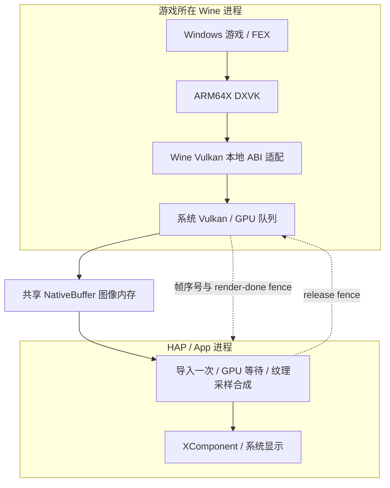

# Direct 渲染与共享图像呈现设计

日期：2026-09-28；更新：2026-09-29。状态：平板 HAP Vulkan 桌面 compositor 已接入，双窗口 fixture 与实际触摸通过；仍为 opt-in，真实游戏/性能和完整异常矩阵待验收。手机 P0 跨进程注册尚未通过，按用户要求搁置。

> **2026-09-29 晚更新**：§10 的反向 Guest export 候选现已实测，`vkAllocateMemory` 内部仍进入 NativeBuffer 的 HDI/SAMGR 等待，0 帧。用户决定手机继续原 Venus 路线，暂停这部分研究。见 [反向 P0 报告](mate80-direct-reverse-export-20260929.md)；§10 的“尚未实现”描述仅保留为提出方案时的历史状态。

本文回答“Guest 自己调用 Vulkan 渲染，Host 只贴图”的具体落点。依据为用户提供的《WineHua ARM64 Direct 渐进式架构重构指导》§2.2、当前实现和 [Mate 80 实测记录](arm64-direct-implementation.md#mate-80-根因修复与手机上屏方案2026-09-28)。不把格式能力查询当作图像共享或上屏通过。

## 1. 目标与已完成范围

目标是 Windows 游戏所在的 Wine 进程直接执行系统 Vulkan，App 只负责窗口、共享成品图像的 GPU 合成与最终显示。这里的 Guest 是 Wine/Windows 运行环境，不是拥有独立 GPU 的虚拟机。

原指导明确“重点不是消灭所有 IPC”。需要区分三个层次：

| 层次 | 是否保留 | 承担的工作 |
| --- | --- | --- |
| 游戏 D3D → DXVK；Wine PE/Unix ABI 适配 | 保留，在游戏进程内执行 | D3D 实现、ABI/句柄适配，最终调用 ARM64 系统 Vulkan |
| Venus/vtest Vulkan 命令编码、跨进程传送、Host 解码执行 | Direct 路径移除 | Host 不重放游戏的 draw/dispatch/resource commands |
| 窗口事件、共享图像身份、完成/释放 fence | 保留 | 管理窗口和共享资源的所有权；不传逐帧像素，也不传绘制命令 |

现状：

- **平板**：Create NCP → 系统 Vulkan → OHOS BufferQueue → **HAP Vulkan 桌面合成**，已在 DXVK 1.10.3 双进程窗口 fixture 上通过重叠、移动、GDI/半透明遮挡、最小化/恢复、关闭/resize、全屏退出和实际触摸检查。这符合目标的共享 GPU 图像路径；真实游戏覆盖、完整窗口/异常矩阵、性能收益和默认切换尚未验收。[本轮证据与边界](direct-vulkan-desktop-20260929.md)。
- **手机**：早期 fork server 与真实 Wine x64/x86 Direct 离屏成立；目前同一 WSI 实现依赖的 producer 无法交接，因此没有 Direct 成品帧交给 App。Venus + DXVK 2.6.2 上屏通过不能补足这一项。
- **App 合成器**：虚拟桌面新增 `DirectVulkanDesktopCompositor`，独占 XComponent Vulkan 输出，按 Wayland 窗口树合成共享 Direct 图像及 SHM UI；有导入缓存、双提交槽、GPU fence 与静态 idle 门控。公共 device/import/output 已抽成 `DirectVulkanContext`，桌面不再依赖诊断 probe；fusion 也已迁到独立 `DirectVulkanPresenter`，生产输出 resize 已通过。[presenter 阶段证据](direct-vulkan-presenter-20260929.md)保留旧包未经预热 scene 启动超时；后续 [启动 gate 修复](direct-desktop-startup-20260929.md) 完成三轮未经预热进程/输入检查与两个完整画面矩阵。性能收益须通过 [Direct/Venus A/B](direct-performance-gate-20260929.md) 量化，完整生命周期和整个重构仍待完成。

## 2. 最终数据路径



两进程各有自己的 Vulkan device、VkImage 和 image view；这些 Vulkan 句柄不会直接跨进程使用。两侧对象绑定的是同一个 NativeBuffer 后端存储。Host 的“贴图”是 GPU 采样成品纹理并绘制到输出目标，不是把 Guest 的命令再运行一遍。

这里的“零拷贝”限定为 Guest → App 图像交接不经过 CPU readback/memcpy/upload，也不增加一份用于交接的全帧 GPU copy。App 合成仍然需要读取输入图像、写输出图像；不宣称零带宽或直接 scanout。

2026-09-29 用户明确约束：此次优化只接受消除 Venus Vulkan 命令传输、且不引入 CPU 图像回读/上传的路径。CPU 回读到共享内存再由 App 上传不作为候选或 fallback；若共享 GPU 图像路径未通过，继续使用现有 Venus。探针少量像素校验仅用于正确性验收，必须从正式帧路径和性能测量中关闭。

## 3. 拆开渲染后端与呈现后端

`WINEHUA_VULKAN_BACKEND=direct` 只表达游戏进程使用系统 Vulkan。WSI/present 的选择应独立封装，不再把“系统 Vulkan 可用”等同于“Create NCP + Binder 可用”。

| 路径 | 渲染执行位置 | 呈现实现 |
| --- | --- | --- |
| 平板 Direct | Wine 进程系统 Vulkan | 现有 NativeWindow + 系统 OHOS swapchain + BufferQueue |
| 手机 Direct（待实现） | Wine 进程系统 Vulkan | Wine 内的共享 NativeBuffer swapchain；Unix socket 交接图像身份/fence |
| Venus fallback | 现有虚拟化路径 | 现有 Venus 私有呈现实现 |

选择依据应是经过验证的启动方式和能力，而非单纯判断 phone/tablet 字符串。初期全部显式 opt-in。能力拒绝、导入失败或 device lost 必须报告真实失败；不能在已有 Direct VkDevice/VkImage 上热切到 Venus。回退发生在下一次进程/会话启动。

平板保持现有系统 WSI，没必要为统一接口而重写成手机的软件 swapchain。双方统一的是提交给 App 合成器的图像/同步语义，而不是强行统一底层进程与窗口 API。

## 4. 手机共享图像设计

### 4.1 App 管理图像池，分配归属由探针决定

App 管理窗口、槽数、尺寸、预算和 generation。已实现的 P0 采用 App 分配 NativeBuffer，fork child 注册尚未通过；§10 新增 Guest Vulkan 分配并导出 NativeBuffer 的反向候选，分配归属以实际探针结果决定。P0 先用单槽重复交接四帧，P1 再验证双槽；产品按协商的最小 image count 与 FIFO 行为支持 2～3 槽，设置每窗口和全局预算。尺寸、stride、usage、格式和 metadata 以实际分配结果为准，不能按 `width * height * 4` 代替实际存储描述。

初始化或 resize 时一次性交接槽位 backing handles。采用 App 分配时，Wine 子进程在自己的系统 Vulkan device 上，以 `VkExternalMemoryImageCreateInfo`、OHOS NativeBuffer import 和 dedicated allocation 创建真实 VkImage；采用 Guest 导出时，Wine 拥有源 VkImage/VkDeviceMemory，App 接收导出的 NativeBuffer 并导入。两种方式都按 OHOS 扩展契约和驱动返回的内存属性构造资源，不自行假设内存类型；App 为同一后端图像缓存自己的 image/view。

图像键采用 `(session, child, surface, generation, slot)`，不只按 fd 整数、指针或复用后的 PID 标识。Wire 消息显式版本化、限定尺寸/长度/fd 数量；生产槽的图像 fd 只在建槽时传输，每帧只发图像键、帧序号及同步 fd。

### 4.2 首要可行性门槛：NativeBuffer 怎么跨进程

已实测：

- 六种 OPAQUE_FD 图像组合返回 `VK_ERROR_FORMAT_NOT_SUPPORTED`；OPAQUE_FD transfer buffer features=0。
- DMA_BUF Vulkan 扩展未公布。
- OHOS NativeBuffer RGBA8 optimal 的 render/sample/transfer 配置支持 import/export，要求 dedicated allocation；SYNC_FD 支持 import/export。

因此不能把 NativeBuffer 的底层 fd 直接当成 Vulkan OPAQUE_FD 或 DMA_BUF 导入。接收端必须重建正确的 OH_NativeBuffer 对象并走 OHOS import。

公开的 `OH_NativeBuffer_WriteToParcel/ReadFromParcel` 是当前可调查入口，但**未提供一个已验证的 Unix socket NativeBuffer codec**。NativeBuffer 的 parcel 与带远程 producer 的 NativeWindow parcel 不同；本地 parcel 操作也不等于跨进程 Binder 调用。仍必须验证实际系统的完整序列化契约和重建过程：

1. 优先寻找目标 SDK/固件提供的受支持 handle 导入/导出路径。必要时核对该版本 SurfaceBuffer 的完整编码，不能以 OpenHarmony master 代替设备版本。
2. 所有 backing/附加 fd 都经 SCM_RIGHTS 复制；元数据有明确范围与版本。不得复制 parcel 中原进程 fd 数字、地址或指针来代替传递。
3. 检查子进程反序列化/注册 NativeBuffer 是否调用禁止的 Binder 路径，验证真实 Vulkan 导入和资源回收。仅能创建一个对象不算通过。
4. 若只能依赖未受支持的内部布局，隔离成受版本/能力约束的实验适配器；前提不满足就停止该候选，不接入产品默认路径。

这个门槛尚未通过，所以共享图像是**待验证的实现方案**，不是已经找到一个通用可用的 API。通过之前不铺开手机 WSI 重写。

### 4.3 帧的所有权与同步

正常循环：

```text
Guest 可领取 → Guest GPU 写入 → 已提交给 App
    → App GPU 采样 → 携带 release fence 归还 → Guest 可再领取
```

“归还”允许 GPU 工作尚未完成，但必须携带正确的 release fence。Guest 下一轮在 GPU 队列等待 fence 后才能重写；不能因为 socket ACK 到达就立刻覆盖。

- Guest present 必须消费应用提供的全部 wait semaphores，再提交图像所有权/布局交接，并导出 render-done SYNC_FD。每个 semaphore 的 wait/signal 次数必须符合 Vulkan 语义。
- App 导入 render-done fence 为临时 semaphore，GPU 等待后采样；提交后导出 release fence，再把槽归还。SYNC_FD 是一次性同步载荷，不能把同一个 fd 整数重复导入当作 timeline。
- 成功导入、成功发送、发送失败、超时/断连的 fd 归属逐项定义；用 RAII 清理各进程自己拥有的 fd 与对象。
- 接收完成、提交完成、GPU 完成、实际显示分别计数。`Present` 返回成功不等同于帧已经可见。
- 使用有界队列和事件唤醒；第一版实现 FIFO 背压，不无界累积帧。等自己提交槽的 fence 可以产生背压，但不以逐帧 `vkDeviceWaitIdle` 或 CPU 轮询同步作为产品方案。
- NativeBuffer 跨 API 的 FOREIGN queue ownership 与同驱动跨进程的 EXTERNAL 语义必须按 OHOS 扩展契约验证，不能直接照搬平板 barrier 常量并宣称正确。

### 4.4 Wine 内的 WSI 适配

手机子进程不持有 XComponent，也不需要伪造一个可交给系统 loader 的 NativeWindow。Wine 对游戏暴露 Win32 surface 与 swapchain，内部采用上述 NativeBuffer 池。至少覆盖：

- surface capabilities、formats、present modes、queue support；只公布已验证组合。
- create/destroy swapchain、get images、acquire semaphore/fence、timeout、present wait、逐 swapchain result。
- 旧 swapchain 与 resize：新 generation 发布前导入完成；旧 generation 保留至所有在途 GPU 使用结束。拒绝过期消息，不能 resize 时立即销毁仍被使用的 image。
- surface lost、device lost、窗口销毁、子进程死亡、socket EOF；唤醒阻塞的 acquire 并回收资源。
- Dxvk 会用到的 BGRA、sRGB、mutable-format 等组合独立验证；RGBA8 小探针通过不意味着这些都支持。

**不能只拦截 `vkQueuePresentKHR`。** 普通导入图像不能未经论证就视为系统 swapchain image。游戏可在 barrier、render pass 等处使用 `PRESENT_SRC_KHR`，同步2、布局和 queue-family 的适配必须整体设计并验证。任何必须的布局映射应限制在本地 WSI，覆盖相关 API，不成为送往 App 的命令协议。现有 Venus 私有 swapchain 的句柄、布局和回收特例不能直接复制成 Direct 实现。

## 5. App 合成接口与代码边界

在共享图像门槛通过后再提取以下职责，避免先大改现有可用路径：

| 组件 | 职责 | 当前代码基础 |
| --- | --- | --- |
| Direct image cache | NativeBuffer 导入、image/view 生命周期、generation 隔离 | `direct_buffer_import_probe.cpp` 的 Import/cache |
| Vulkan compositor | 等待图像 fence、采样、缩放/裁剪、绘制到 XComponent、输出同步 | 同文件的输出 pipeline；将诊断像素检查独立保留在 probe |
| BufferQueue source | 获取系统队列帧并释放，平板使用 | `direct_wine_surface_controller.cpp` 的 consumer |
| Shared-buffer source | 管理手机槽、接收帧/归还 fence、处理断连 | 新增，P0/P1 通过后实现 |
| Wine present backend | Native OHOS WSI / shared-buffer WSI 的 dispatch | `winewayland.drv/vulkan.c`、`win32u/vulkan.c` 的明确分支 |
| Process transport | fork/NCP、fd bootstrap、退出通知 | `phone_process.cpp`、`wine_child_ipc*`；保持进程管理职责 |

Host 统一接收 `FrameLease` 一类进程内对象：图像缓存键、buffer 引用、extent/format、generation/serial、acquire fence、return/release 回调。它是接口建议，不是直接发送 C++ 对象的 wire 格式。Host 不接收 shader、descriptor、command buffer 或 draw 参数。

Wayland 继续负责窗口与输入控制；Direct Vulkan 帧不走 wl_shm 像素上传。首阶段只验证一个游戏窗口；统一桌面、多窗口排序、透明度、裁剪和 subsurface 属于后续组合验证。暂不同时推进 OpenGL/Zink 或音频改造。

## 6. 按结果推进的顺序

| 阶段 | 实现与验收 | 失败时的边界 |
| --- | --- | --- |
| P0：同一块图像跨进程 | App 分配 64×64 NativeBuffer；实际 fork 子进程导入；GPU 写已知图案；App GPU 等待/采样；回传 release fence 并重复使用。记录双方 PID、图像身份、同步与像素结果 | codec/注册/GPU import 任一步失败就停在该环节，不做 Wine WSI |
| P1：双槽与生命周期 | 两槽交替、resize、旧代延迟帧、窗口销毁、进程异常退出；循环运行检查 fd/NativeBuffer/Vulkan 对象不持续增长 | 不以每帧重建或全局 idle 掩盖同步错误 |
| P2：手机原生 WSI 契约 | 先用真实 Wine Vulkan 探针完成 acquire/render/present、布局/同步、resize与错误返回；App 截图确有图案 | 不用离屏 PASS 或 `Present` 返回值代替可见输出 |
| P3：同机 DXVK 对照 | Mate 80 上相同新 WSI，先 1.10.3，再 2.6.2；验证资源矩阵、立方体、resize。平板旧 Direct 做必要回归 | 不跨设备/跨 WSI 比较后把差异归咎 DXVK 版本 |
| P4：收益与产品化 | 同设备同场景 Direct/Venus：frame time、CPU、IPC 字节、导入次数、额外 copy、资源量、延迟；再做真实游戏与多窗口 | 数据通过后才讨论默认启用；不预先承诺 FPS 增幅 |

P0 的 CPU 少量像素读回仅用于诊断校验；产品帧路径必须关闭。P0/P1 的长跑要同时验证回收和错误路径，不只检查首帧。

验收计数应能证明：该 Direct 测试的绘制命令没有进入 Venus/vtest；图像 fd/对象只在建槽/换代导入；逐帧只交接小量元数据和同步 fd；无 CPU 全帧读回/上传、无额外交接用全帧 GPU copy、无逐帧 device idle。记录 native queue submit 与 App composite submit 的区别，避免把 Host 必需的贴图提交当成游戏命令重放。

视觉验收必须看到正确测试窗口与内容。现有全图颜色检查曾把控制页按钮误判为 cube，不能单独作为通过证据。当前 phone 冷启动也有一次 wineboot 超时后重试通过，需保留独立的进程启动稳定性条目。

## 7. 下一步决策

**P0 手机 NativeBuffer 跨进程探针已实现**。当前先解决实测的子进程注册卡点，回答共享图像对象能否在受限制的 fork 子进程安全重建、导入和同步。如果成功，才按 P1/P2 扩展；如果失败，保留具体失败 API/阶段并研究受支持的进程或导入接口。不会把“重新传 Vulkan 命令给 Host”包装成完成 Direct 目标。

## 8. P0 实现与实验边界（2026-09-29）

代码包括 App launcher、独立 native child、Unix transport 和隔离的 NativeBuffer parcel 适配器；入口是 `winehua.mode=direct-phone-shared-buffer-probe`。不进入 Steam、FEX 或默认渲染路由。

- App 分配 64×64 RGBA8 NativeBuffer，以 `SCM_RIGHTS` 交接所有 backing/附加 fd。最终 wire version 4，最多 16 fd、256 reserve ints；拒绝版本、长度、fd 数量、截断和字符串校验失败，失败清理自己持有的 fd。
- 对 Mate 80 实际的 `reserveFds=1/reserveInts=65` 布局，将系统重新注册时变化的第 13、14 项成对清零。此前只清第 13 项的候选曾在本地往返被拒绝：第 14 项由 90 变为 91（[有限日志](evidence/mate80-phone-shared-p0-allocator-pair-20260929.log)）。这些私有字段的含义未公开，fd/映射检查未建立地址关联，也不足以断言它们不是 CPU 地址。系统解码后必须重新生成非全零值；其他标量、原始字段、附加整数全部严格匹配，两个 fd 的 `st_dev/st_ino/st_size` 也必须相同。其他不认识的 allocator 布局拒绝。它仍是设备限定的实验 codec，不是公共稳定 transport API；本地往返也不代替跨进程像素验证。
- child 代码直接调用系统 Vulkan，使用 dedicated NativeBuffer import、GENERAL/EXTERNAL ownership、render/release SYNC_FD 往返。App 复用 GPU sampler，release fence 在诊断读回前归还。设计验收要求 4 帧像素正确、双方各导入图像 1 次、App 复用 3 次、同步往返 4 次；这里只说明代码契约，尚无实机 GPU 交接通过结果。
- 诊断只读每帧 9 个 uint32，不读取或上传全帧。最终正式帧路径仍必须关闭诊断读回。未实现双槽/resize、手机 Wine swapchain 或 DXVK Direct 上屏。
- 异常处理有 packet deadline、失败杀 child、退出回收和 fd 统计。`childKilledByProbe=true` 必须与原生崩溃区分；超时后清理产生的 SIGKILL 不作为根因。
- 最终 child 先创建系统 Vulkan instance/device，再反序列化 NativeBuffer，以排除初始化顺序差异。NativeBuffer 使用 RAII，声明于 Vulkan writer 之前，确保先销毁 Vulkan image/memory/device 再释放 buffer；decode 失败同样清理引用。隔离的 HiDebug watchdog 只用于探针 child，不接入游戏进程。

Linux host 对实际 transport 的测试已通过：真实 fd backing alias、CLOEXEC、400 个非法 packet 的清理、无 fd 泄漏、超时和非法 send fd。该测试不覆盖 Harmony NativeBuffer/GPU。

Mate 80 本地 parcel 解码/重新编码和 fd identity 验证已通过。实际 fork child 在 `OH_NativeBuffer_ReadFromParcel` 内超过 15 秒，未进入 Vulkan image import，结果是 FAIL、0 帧。保留/清理低 4GB 映射的 A/B 都卡在同一 API，因此本次低地址清理不能解释该卡点。

官方 HiDebug 等待栈已定位到 `ReadFromParcel → SurfaceBufferImpl::SetBufferHandle → IDisplayBuffer::Get → IAllocator::Get → HDI ServiceManager::Get → SAMGR GetSystemAbilityWrapper/Recompute → usleep`（[最初完整等待栈](evidence/mate80-phone-shared-p0-hdi-wait-stack-20260929.json)，HAP `34b30b68…`）。本地 parcel 重建仍然依赖接收进程获取系统 HDI allocator 服务，不能因为 fd transport 成功就宣称绕过了系统 IPC。实测是服务获取重试，不是图像格式或 Vulkan device 错误。它与 SELF_FORK 的 Binder 限制相符，但本栈没有提供明确的 Binder 拒绝码。

### 最终同包对照与暂停点

最终签名 HAP SHA-256：`04e91fb20aa6834e2e68c0b71a74a9180f581ea24e5cfca34c9a0d69b25d5a79`，已覆盖安装到无线 Mate 80。三种启动方式用同一包、本地往返验证均通过：

| 入口 | 实际结果 | 证据 |
| --- | --- | --- |
| 直接解析系统 `libchild_process.so` 的 Start，绕过项目 override | `launchCode=16010004`，PID=-1，系统未创建 child | [系统 Start](evidence/mate80-phone-shared-p0-system-start-v4-20260929.json) |
| 早期 server 的系统 musl `_Fork()`，清理低映射 | child PID=51859，`childDeviceCreated=true`，系统 loader/Maleoon 920；随后停在同一 HDI/SAMGR 等待栈，0 帧 | [device-first](evidence/mate80-phone-shared-p0-device-first-v4-20260929.json) |
| 早期 server 的普通 `fork()`，保留低映射并使用高编号 bootstrap fd | child PID=52301，`childDeviceCreated=true`；仍在同一 HDI/SAMGR 等待栈，0 帧 | [普通 fork](evidence/mate80-phone-shared-p0-standard-fork-v4-20260929.json) |

两次 fork 超时均由父侧探针发送 SIGKILL，server 观察 exit 并回收；不是原生 SIGKILL 崩溃。普通 fork 的高编号 fd 已解决此前的 `buffer_send` 问题，但没有解决服务获取。最终同包 D0 **PASS**：系统 Vulkan 1.3.309、Maleoon 920、离屏像素正确、child exit 0 且已回收（[D0 回归](evidence/mate80-phone-shared-p0-final-d0-20260929.json)）。它只验证原生 D0；本轮没有重跑真实 Wine/DXVK 上屏，历史离屏 PASS 不扩展为本包 Wine 回归。

HAP 已核对包含 `libdirect_shared_buffer_probe.so`，该 SO SHA-256 为 `2f722fd50f332e8555b2e66dd11b272aa671e4901e70415b52ce85a044a20808`。完整 smoke 载荷保持 `smoke-v2-2e5e6843ea9d`，包含 33 个测试 EXE；payload SHA-256 为 `6df179ec6d1915357b28a691b5fb97de9b320bcb33ad79be2a00984e70db59e6`。Linux transport 测试在 wire v4 再次 PASS。fork 两轮父进程 fd 均为 43→44，系统 Start 为 44→44；这组冷启动样本不足以证明长跑无泄漏。

**当前 P0 FAIL，0 个跨进程 GPU 帧；P1/P2 未启动。** `imageCpuReadBytes/imageCpuUploadBytes/imageGpuCopyCount=0` 在 0 帧情况下没有性能或零拷贝成功含义。下一步必须先找到并验证能获取 SAMGR/HDI 的受支持 Wine 进程入口，或官方不依赖该注册链的 NativeBuffer 导入接口，再使用此探针验收同一图像与 fence。改变 DXVK、FEX、格式或布局均不能修复当前尚未到达的 image import 阶段。

本机 API 12–23 离线文档对候选进程入口还有明确限制：Start/StartWithConfigs、UIAbility 的 `processMode` 仅面向 Tablet/PC/2in1；AppServiceExtensionAbility 仅支持 2in1 且需 ACL。它们不能直接作为已可用的手机替代入口；手机固件/API 是否另有受支持入口仍需平台核实。不要通过指针搬运、伪造 NativeBuffer 或重新传 Vulkan 命令来跳过 P0。

结束前已 force-stop App；设备进程列表未见本应用、fork server、P0 child 或 wineserver 残留。临时 10 分钟熄屏设置已用 `power-shell timeout -r` 恢复；工作树未提交。

原始 A/B 结果：[清理映射](evidence/mate80-phone-shared-p0-clean-maps-20260929.json)、[保留映射](evidence/mate80-phone-shared-p0-preserve-maps-20260929.json)；[带退出/清理分类的结果](evidence/mate80-phone-shared-p0-read-timeout-20260929.json)。SDK `BufferHandle` 尾部与手机实际 parcel 不符的[诊断](evidence/mate80-phone-shared-p0-abi-mismatch-20260928.log)和本地 allocator 变化的[诊断](evidence/mate80-phone-shared-p0-allocator-roundtrip-20260928.log)均保留；代码已经不再直接读 SDK handle 的尾部。

## 9. PomeloTechLabs DXVK Native 代码对照（2026-09-29）

用户反馈 OHOS DXVK Native 可在手机运行，本轮核对组织内两个仓库的固定版本：

- [dxvk-ohos-legacy](https://github.com/PomeloTechLabs/dxvk-ohos-legacy/tree/fb2cfafba97790a1cbf2ae902c9d09971ea989b3)，DXVK 1.10.3，commit `fb2cfafba97790a1cbf2ae902c9d09971ea989b3`。
- [dxvk-ohos-modern](https://github.com/PomeloTechLabs/dxvk-ohos-modern/tree/7b924f77be58a5bb701e200bfad908991faec08a)，DXVK 2.6.2，commit `7b924f77be58a5bb701e200bfad908991faec08a`。

**代码支持“窗口与渲染处在同一进程，因此避开当前 fork 资源注册卡点”的判断。** 两个仓库是 DXVK 库源码，没有手机 HAP 的 ArkTS/EntryAbility 启动代码；本轮没有运行这些库，也不能由库内无 fork 推断整个调用应用绝无其他进程。能确认的是 Native WSI 使用进程内 registry 和本进程原生窗口，没有实现我们 P0 的跨进程图像重建。

具体链路：

1. `DXVKOhosRegisterWindow(OHNativeWindow*, ...)` 的公开契约要求在 XComponent surface-created 回调中注册窗口。DXGI 库的静态 `WindowRegistry windows` 保存引用，返回不复用的本地 ID；这个整数不是系统可跨进程兑换的窗口句柄。
2. 2.6.2 的 `OhosWsiDriver::createSurface()` 调用 DXGI 导出的 `DXVKOhosCreateSurface()`；后者在同一 registry 查找 ID、取得 NativeWindow，并将其写入 `VkSurfaceCreateInfoOHOS.window` 后调用 `vkCreateSurfaceOHOS`（[注册与 surface 构造](https://github.com/PomeloTechLabs/dxvk-ohos-modern/blob/7b924f77be58a5bb701e200bfad908991faec08a/src/dxgi/dxgi_ohos_window.cpp#L37)，[WSI dispatch](https://github.com/PomeloTechLabs/dxvk-ohos-modern/blob/7b924f77be58a5bb701e200bfad908991faec08a/src/wsi/ohos/wsi_platform_ohos.cpp#L104)）。窗口的 resize revision、retirement 与 lease 也在进程内管理。
3. 1.10.3 的 Presenter 同样通过 `findWindow()` 获取本地登记，再在 `createNativeSurface()` 使用这个 NativeWindow（[Presenter](https://github.com/PomeloTechLabs/dxvk-ohos-legacy/blob/fb2cfafba97790a1cbf2ae902c9d09971ea989b3/src/vulkan/vulkan_presenter.cpp#L667)）。两版都创建系统 swapchain，最终调用 `vkQueuePresentKHR`。
4. 1.10.3 的 native 构建直接链接 `vulkan/native_window`；2.6.2 的非 Windows loader 加载 `libvulkan.so`。所核对的 Native WSI 没有调用 NativeChildProcess、NativeBuffer/NativeWindow ReadFromParcel 或 SCM_RIGHTS 图像交接。`dxbc_compiler.h` 中的 fork/join 是着色器术语，不是创建进程。

```text
Native：拥有 XComponent 窗口的应用进程
          → 同进程 DXVK Native → 系统 Vulkan/OHOS swapchain → 系统显示

WineHua 手机 P0：App 分配 NativeBuffer
          → socket/fd → fork Wine/探针进程
          → ReadFromParcel 注册【HDI/SAMGR 服务获取超时】→ 尚无图像导入/呈现
```

Native 仍经系统 WSI/BufferQueue/RenderService 显示，系统 IPC 不会消失；它没有 App 与 Wine 间的自制图像 transport，也没有 Venus Vulkan 命令重放。当前 P0 则要求两个应用进程各自持有同一后端图像的对象，因此额外遇到了接收端注册前提。

| 场景 | 窗口与渲染归属 | 当前依据 |
| --- | --- | --- |
| OHOS DXVK Native | 登记 NativeWindow 与使用该 ID 的 WSI 位于同一进程 | 两版源码；手机可运行是用户提供的信息 |
| WineHua 平板 Direct | App 管窗口；系统 Create NCP 中的 Wine 使用经 Binder 交接的 producer | 既有实机 Direct 上屏通过 |
| WineHua 手机 Direct/P0 | App 管窗口/图像；自行 fork 的 Wine/探针尝试取得 producer 或注册共享图像 | WSI 无 producer；P0 HDI/SAMGR 超时、0 帧 |

因此，`16010004` 证明手机当前不能使用所测系统 NCP 入口，不能泛化为“手机不能 Vulkan Direct 上屏”。Native 的成功与此并不矛盾：其呈现路径不需要该入口。fork 后具体是继承的系统 IPC 状态、资源清理还是平台策略导致服务获取失败，本轮栈尚不足以全部区分；现有低映射/fork 类型 A/B 也未验证一个完整保留 App 系统服务上下文的 child。不能简单断言保留某个 fd 就会修复。

对后续设计的影响：应优先研究**执行 Vulkan 的进程如何拥有合法 NativeWindow 或可用的系统图形服务上下文**。Native 的 registry/lease/resize 生命周期可作为参考，但把其 ID 发给现有 fork child 不会传递窗口或权限。将 Wine/游戏渲染并入拥有窗口的 App 进程是另一条需要单独评估的架构路线，涉及 Wine/FEX 生命周期、地址空间、线程与多进程语义；不能通过替换一份 DXVK 库就成立。保留游戏进程渲染、App 贴图的目标时，仍必须解决 P0 的跨进程注册门槛。

## 10. 自定义图像交接的新候选：Guest Vulkan 导出（2026-09-29）

本节是手机恢复验证后的候选，当前按用户要求搁置，不是本轮执行顺序。当前工作以平板 D5 为主，最终 Vulkan 桌面包和验收边界见 [2026-09-29 平板验收](direct-vulkan-desktop-20260929.md)。

针对“能否自己传递”的补充：socket/SCM_RIGHTS 已经能够传递 backing fd、受限元数据和同步 fd，传输不是当前卡点。`OHNativeWindow`、`OH_NativeBuffer`、`VkImage/VkDeviceMemory` 的进程内对象或指针不能直接发送给另一进程使用；接收端仍需建立有效对象。本轮排除 CPU 图像回读、共享内存像素搬运与 App 上传；自定义传递只指 GPU 图像后端身份和 fence。此路径失败时保留现有 Venus，不引入另一条回读呈现链。

**建议优先做一个反向 P0，尚未实现或装机验证：让 Guest Vulkan 分配可导出图像，App 成为 NativeBuffer 接收/注册端。** 这保留 Wine 进程执行系统 Vulkan、App 只采样成品图像的目标，没有把绘制命令搬回 App。

候选依据与限制：

- 当前 NDK 的 `<vulkan/vulkan_ohos.h>` 公开声明 `VkMemoryGetNativeBufferInfoOHOS` 和 `vkGetMemoryNativeBufferOHOS(device, ..., OH_NativeBuffer**)`，用于从 Vulkan memory 取得 NativeBuffer；起始 API 10。本机离线文档也确认该入口。本轮仅核对头文件/API，尚未确认 Mate 80 的实际 export 函数行为。
- 最终手机 D0 对 RGBA8 optimal 的两组 OHOS NativeBuffer 配置返回 `features=7`（importable/exportable/dedicated-only）；这是尝试 dedicated image export 的能力依据，不能代替实际 allocation/export。
- 目前失败的是 App→fork child 的 `ReadFromParcel` 注册。反向候选在 child 不调用这个接收 API，而由正常 App 进程接收并注册；App 的既有本地 decode/re-encode 已通过。**驱动分配、导出或 WriteToParcel 仍可能内部访问 HDI/SAMGR；这正是新探针需要回答的未知项，不能承诺反向一定绕开系统 IPC。**

```text
Guest：系统 Vulkan 创建可导出 VkImage/专用内存
  → vkGetMemoryNativeBufferOHOS → 导出 backing fd/元数据
  → Unix socket / SCM_RIGHTS
App：NativeBuffer 解码/注册 → Vulkan import/cache → GPU 采样/输出
Guest → render-done SYNC_FD；App → release SYNC_FD
```

先验证 64×64 单槽四帧，按真实失败阶段记录：device ready → exportable image → dedicated allocation/bind → get NativeBuffer → encode/send → App decode → App GPU import → 四帧像素与 fence 往返 → 释放/退出。分配参数按 OHOS 扩展契约配置，不对普通 VkImage 临时调用导出函数并假定成立。Child 的 HiDebug watchdog 分别覆盖 allocation/export 阶段，保留 15 秒父侧 deadline；服务等待与 Vulkan 返回错误分开记录。

验收计数随资源归属调整：Guest 图像 allocation/export 各一次，Guest NativeBuffer import 为零；App 图像 import 一次、reuse 三次；四次 render/release 交接，非负 SYNC_FD 的实际导入数与已完成的 -1 fence 分开记录。源 image/memory/NativeBuffer 持有到 App 最后一次 release、Guest GPU 完成及双方 teardown 之后，不以 fd 已发送就释放。仍只允许 144 字节总诊断读回；没有验证四帧时，零 CPU copy 计数没有成功含义。

复用现有严格 fd/metadata codec，但导出的 allocator 布局若不同，先记录诊断并拒绝未知布局，不能为通过测试随意忽略字段或直接搬运原进程地址。该实验继续与 Wine/Steam/FEX 默认路径隔离；通过后再推进 P1/P2。

若 allocation/export 仍在同一系统服务链阻塞，反向候选没有突破门槛：继续核实受支持的系统服务上下文/进程入口，再评估同进程渲染架构。`VK_OHOS_native_buffer` 的低层 BufferHandle 结构在本机头文件中已标为移入内部 `vk_ohos_native_buffer.h`（公共 SDK 无该文件），且设备与 SDK 的 handle 尾部已有实际 ABI 差异；不将手工伪造对象或依赖内部 struct 的旁路列为首选产品方案。
